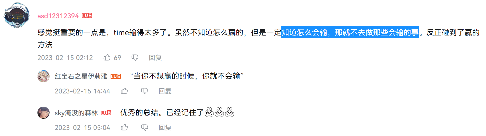

import Figure from '@site/src/components/Figure';

## Q & A

1. 是不是首创？

   不是，我是阅读了国外很多认知科学的书（《为什么学生不喜欢上学》（**强推**），《如何学习》，《认知科学》等），并结合下面的致谢做本土化实践成功后写出的本文，此外其实还有其他大佬发现过类似这种偷好答案的方法：[理科生不可不知的复原学习法](https://zhuanlan.zhihu.com/p/366164683)，所以说英雄所见略同。

2. 一整套流程要多久？

   看个人，对于一张 2h 的卷子，我一般刷 1.5 h， 偷答案可能得花 1h。

3. 要多久见效？

   偷得到位的话，一天提 1~5 分。

4. 能不能用在其他领域？

   除了第六境界的创新领域外都能，想好那个领域的“真题”和“好答案”是什么就行。我见过的除学校学习外的例子：[电竞](https://www.zhihu.com/question/583865026/answer/2894592788)，[足球](https://www.zhihu.com/question/615166985/answer/3146733285)，开车。

   

5. 你行测刷了多少？

   👇大概 30 天的量，当时对刷题理解还没那么深。现在回头看，**一天一张卷（要偷答案而不只是刷），面试无忧，一天两张卷，大概率前二**。
   <Figure src={require('./img/image-20231004195022305.png').default} style={{zoom:0.5}}></Figure>

6. 还有什么能提醒的？

   牢记 28 定律，先在错的多的题上，偷好答案。
   
## 致谢

全篇大量偷（偷：指注入了自己的理解）了以下慷慨无私的前辈的文章/回答：

- [liuyubobobo](https://github.com/liuyubobobo)
  - [如果高效学习有什么秘诀的话，那就都在这里了：）](https://mp.weixin.qq.com/s/mvRBDwzVebz4BGAEr8MMtw)
  - [万能学习法](https://mp.weixin.qq.com/s/TgQ0nj5nP6a36LpMmER3Uw)

- [@Haojun（杀题哥）](https://www.zhihu.com/people/haohaojun/answers/by_votes)
  - [成绩下跌原因不知，可以分析一下吗？](https://www.zhihu.com/question/40481755/answer/86816870)
  - [如何看待中国学生为了进 Google、微软等外企疯狂地刷题？北美学生想进这些名企也要刷题吗？](https://www.zhihu.com/question/35133069/answer/97832096)

没有前辈们的倾囊相授，我可能也还陷在应试的泥潭沼泽中。

他们是柏拉图《理想国》中明明可以走出洞穴独占阳光而选择了转向洞穴分享所知的先行者们。